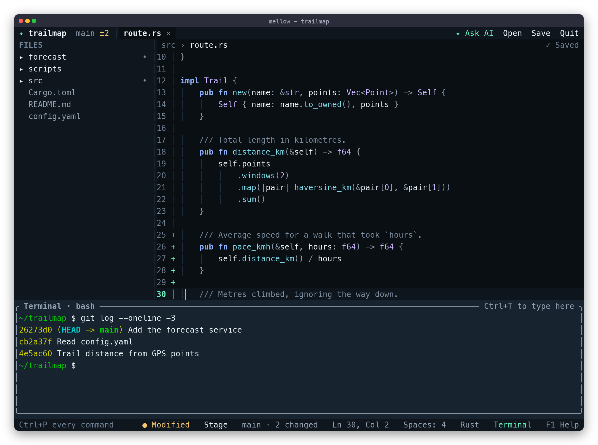
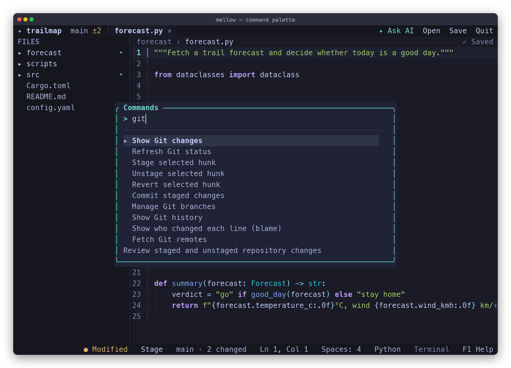
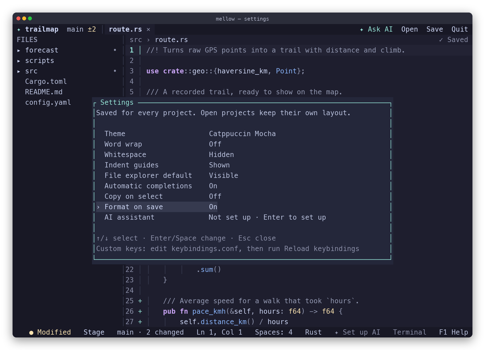
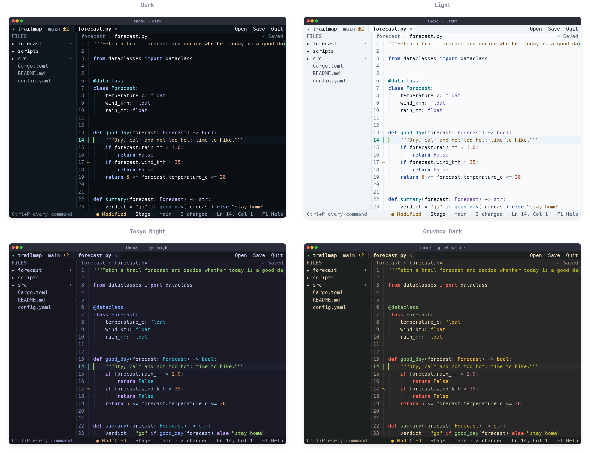

<div class="mellow-hero" markdown>


# Mellow

<p class="mellow-tagline"><strong>The calm terminal editor.</strong><br>
No modes, no manual: just start typing.</p>

[Install Mellow](install.md){ .md-button .md-button--primary }
[Get started](getting-started.md){ .md-button }
[GitHub](https://github.com/ritru-labs/mellow){ .md-button }

<p class="mellow-meta">Version 0.2.1 beta · macOS and Linux · free and open source (Apache-2.0) · crafted by Ritru Labs</p>

</div>

<div class="mellow-install" markdown>

=== "macOS and Linux"

    ```bash
    curl -fsSL https://github.com/ritru-labs/mellow/releases/latest/download/install.sh | sh
    ```

=== "Homebrew"

    ```bash
    brew install ritru-labs/tap/mellow
    ```

=== "Cargo"

    ```bash
    cargo install mellow --locked
    ```

=== ".deb / .rpm"

    Packages for Debian, Ubuntu, Fedora, RHEL, Amazon Linux and more:
    see [Install](install.md).

</div>

{ .mellow-shot .mellow-hero-shot }

<div class="mellow-section" markdown>

## Everything you need, nothing to memorise

Familiar keys, a mouse that works, and every command one search away. Mellow
keeps what makes terminal editors great (speed, SSH, the keyboard) and drops
the learning curve.

</div>

<div class="grid cards" markdown>

-   :material-keyboard-outline: **No modes**

    Typing types. `Ctrl+S` saves, `Ctrl+Z` undoes, `Ctrl+Q` quits: the keys
    you already know work.

-   :material-magnify: **Every command, one search away**

    `Ctrl+P` finds any action by name, and `F1` shows the keys your terminal
    can send.

-   :material-source-branch: **Git built in**

    Changes in the gutter, stage or revert a hunk, commit, branch, pull and
    push, all in the background with a cancel.

-   :material-console: **A real terminal**

    `Ctrl+T` opens your shell beside your code; press it again to come back.

-   :material-auto-fix: **Tidy code on save**

    Smart indentation as you type, and optional format on save with rustfmt,
    ruff, shfmt, prettier, gofmt and more.

-   :material-lightbulb-on-outline: **Language servers**

    Completion while you type, problems, and go to definition for Rust, Python,
    TypeScript, Go and more.

-   :material-shield-check-outline: **Your work is safe**

    Crash recovery brings unsaved edits back, saves are atomic, and Mellow
    asks before overwriting a file that changed on disk.

-   :material-creation-outline: **AI, only if you want it**

    Claude, OpenAI, Gemini or local Ollama. Every change is shown for review
    before it applies, and nothing is sent unless you ask.

-   :material-palette-outline: **Six themes and a mouse**

    Dark, Light, Tokyo Night, Catppuccin, Gruvbox and High Contrast. Click,
    drag, double-click and scroll, or keep your terminal's own selection.

</div>

<div class="mellow-section" markdown>

## Find any command in a keystroke

Press `Ctrl+P` and type what you want to do: "git", "theme", "split",
"format". The palette shows the shortcut for next time.

</div>

{ .mellow-shot }

<div class="mellow-section" markdown>

## Tidy code every time you save

Turn on **Format on save** and Mellow runs your language's own formatter when
you save. If the formatter is missing or the file has a syntax error, your
text is saved as typed and the status line tells you why.
[How it works](settings.md#format-on-save)

</div>

{ .mellow-shot }

<div class="mellow-section" markdown>

## Six themes, readable everywhere

Dark, Light, High Contrast, Tokyo Night, Catppuccin Mocha and Gruvbox Dark,
each checked for readable contrast, with fallbacks for terminals without true
colour. [All themes](themes.md)

</div>

{ .mellow-shot }

<div class="mellow-section" markdown>

## Runs where you work

macOS on Apple silicon and Intel; Linux on x86_64 and ARM64. Tested on Amazon
Linux, Rocky, AlmaLinux, CentOS Stream, Fedora, openSUSE, Debian, Ubuntu,
Alpine and Arch. Works the same over SSH.

</div>

<div class="mellow-cta" markdown>

[Install Mellow](install.md){ .md-button .md-button--primary }
[Read the keys](keys.md){ .md-button }
[Report an issue](https://github.com/ritru-labs/mellow/issues){ .md-button }

</div>
